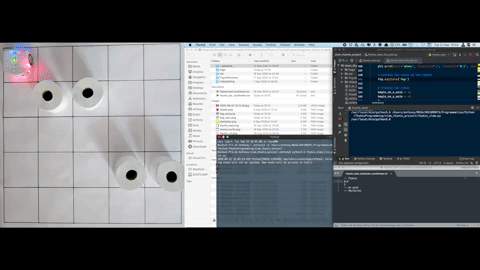

# Thymio SLAM
Simple Python SLAM implementation using A* algorithm and IR frontal proximity
sensor of [Thymio](https://www.thymio.org/) educational mobile robot.

## Table of contents
* [1. Description](#description)
* [2. Getting started](#getting-started)
    * [2.1 Dependencies](#dependencies)
    * [2.2 Installing](#installing)
    * [2.3 Working conditions](#working-conditions)
    * [2.4 Executing program](#executing-program)
* [3. Version history](#version-history)

## 1. Description
Python implementation of Simultaneous Localization And Mapping (SLAM) using IR
frontal proximity sensor of a Thymio educational robot. The path towards goal
is continuously adjusted according to the newly detected obstacles
(cf. [YouTube video](https://www.youtube.com/watch?v=Nnsx8-H72Wk)).

## 2. Getting started

### 2.1 Dependencies
* Tested on macOS Catalina version 10.15.7
* Python 3.6

### 2.2 Installing
`pip install -r requirements.txt`

### 2.3 Working conditions
⚠️ Do not edit `thymio_slam_obstacles_coordinates.txt` (this file will be automatically updated as the robot discovers the map on its way towards the goal)

⚠️ Thymio has to be calibrated to turn exactly 90° and to go forward by about 12[cm] (cf. `time_turn_left`, `time_turn_right`, `time_go_forward`, `left_adjustment_go_forward`, `right_adjustment_go_forward`)
* Start position: (ys,xs) = (0,0), orient = 'S'
* The box (0,0) has to be free (start position)
* The box (4,4) has to be free as well (end position, i.e. goal)
* No obstacles should be placed directly on the border of the arena

### 2.4 Executing program
`python3.6 thymio_slam.py`

## 3. Version history
* 0.1
    * Initial release